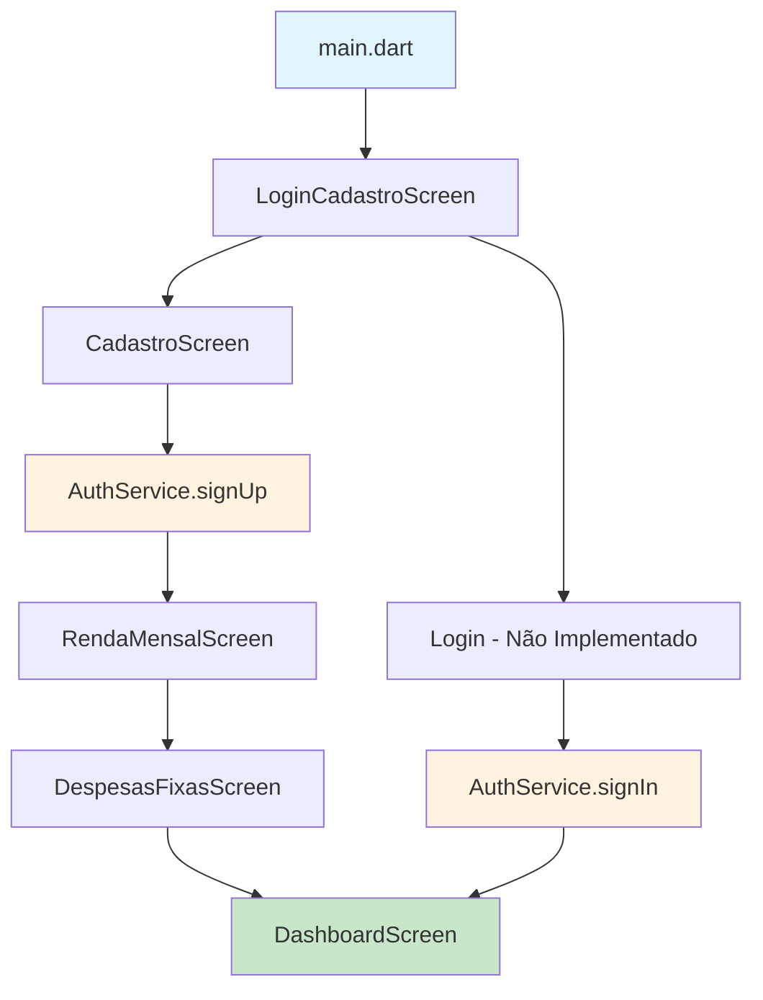

# Fluxo de Cadastro e Login - Horizon Finance

## Visão Geral

O Horizon Finance implementa um sistema completo de autenticação usando **Supabase** como backend e **Flutter Riverpod** para gerenciamento de estado. O fluxo inclui cadastro, login, onboarding e navegação para o dashboard principal.

## Arquitetura do Sistema

### Tecnologias Utilizadas
- **Frontend**: Flutter com Dart
- **Backend**: Supabase (PostgreSQL + Auth)
- **Gerenciamento de Estado**: Flutter Riverpod
- **Geração de Código**: Freezed para modelos imutáveis

### Estrutura de Arquivos
```
lib/
├── features/
│   ├── auth/
│   │   ├── models/
│   │   │   ├── auth_state.dart          # Estado de autenticação
│   │   │   └── auth_state.freezed.dart  # Código gerado
│   │   └── services/
│   │       └── auth_service.dart        # Serviço de autenticação
│   └── users/
│       └── model/
│           └── user_model.dart          # Modelo do usuário
├── screens/
│   ├── auth/
│   │   ├── login_cadastro_screen.dart   # Tela inicial
│   │   ├── cadastro_screen.dart         # Formulário de cadastro
│   │   ├── renda_mensal_screen.dart     # Onboarding - Renda
│   │   └── despesas_fixas_screen.dart   # Onboarding - Despesas
│   └── dashboard/
│       └── dashboard_screen.dart        # Tela principal
└── main.dart                           # Configuração inicial
```

## Fluxo Detalhado

### 1. Inicialização da Aplicação

**Arquivo**: `lib/main.dart`

```dart
void main() async {
  WidgetsFlutterBinding.ensureInitialized();
  
  // Inicializa o Supabase
  await Supabase.initialize(
    url: 'https://qtneqexgrvkfcqtgypyl.supabase.co',
    anonKey: 'eyJhbGciOiJIUzI1NiIsInR5cCI6IkpXVCJ9...',
  );

  runApp(
    const ProviderScope(
      child: HorizonsFinanceApp(),
    ),
  );
}
```

**Características**:
- Configuração do Supabase com URL e chave anônima
- Wrapping da aplicação com `ProviderScope` para Riverpod
- Tema personalizado com cores do Horizon Finance

### 2. Tela de Login/Cadastro Inicial

**Arquivo**: `lib/screens/auth/login_cadastro_screen.dart`

**Funcionalidades**:
- Interface de login com campos de email e senha
- Botão "Entrar" (atualmente navega diretamente para o dashboard)
- Link para "Esqueceu a senha?" (não implementado)
- Botão para navegar para tela de cadastro

**Interface**:
- Design limpo com card centralizado
- Campos de entrada com ícones
- Botões estilizados com cores do tema
- Navegação para `CadastroScreen`

### 3. Processo de Cadastro

**Arquivo**: `lib/screens/auth/cadastro_screen.dart`

#### 3.1 Validação de Formulário
```dart
// Validações implementadas:
- Nome: mínimo 3 caracteres
- Email: formato válido com @
- Senha: mínimo 6 caracteres
- Confirmação: deve coincidir com a senha
```

#### 3.2 Integração com AuthService
```dart
Future<void> _handleCadastro() async {
  if (_formKey.currentState!.validate()) {
    try {
      await ref.read(authServiceProvider.notifier).signUp(
        email: _emailController.text.trim(),
        password: _passwordController.text,
        name: _usernameController.text.trim(),
      );
      
      // Sucesso: navega para onboarding
      Navigator.of(context).pushReplacement(
        MaterialPageRoute(builder: (context) => const RendaMensalScreen()),
      );
    } catch (e) {
      // Exibe erro via SnackBar
    }
  }
}
```

#### 3.3 Estados de Loading
- Campos desabilitados durante o processo
- Indicador de progresso no botão
- Prevenção de múltiplos envios

### 4. Serviço de Autenticação

**Arquivo**: `lib/features/auth/services/auth_service.dart`

#### 4.1 Configuração do AuthService
```dart
class AuthService extends Notifier<AuthState> {
  SupabaseClient get _supabase => ref.read(supabaseClientProvider);

  @override
  AuthState build() {
    return const AuthState();
  }
}
```

#### 4.2 Método de Cadastro (signUp)
```dart
Future<void> signUp({
  required String email,
  required String password,
  required String name,
}) async {
  try {
    state = state.copyWith(isLoading: true, errorMessage: null);

    final response = await _supabase.auth.signUp(
      email: email,
      password: password,
      data: {'name': name},
    );

    if (response.user != null) {
      state = state.copyWith(
        isLoading: false,
        isAuthenticated: true,
        userId: response.user!.id,
        email: response.user!.email,
        name: name,
      );
    }
  } on AuthException catch (e) {
    // Tratamento de erros específicos do Supabase
  }
}
```

#### 4.3 Método de Login (signIn)
```dart
Future<void> signIn({
  required String email,
  required String password,
}) async {
  try {
    state = state.copyWith(isLoading: true, errorMessage: null);

    final response = await _supabase.auth.signInWithPassword(
      email: email,
      password: password,
    );

    if (response.user != null) {
      state = state.copyWith(
        isLoading: false,
        isAuthenticated: true,
        userId: response.user!.id,
        email: response.user!.email,
      );
    }
  } on AuthException catch (e) {
    // Tratamento de erros
  }
}
```

#### 4.4 Tratamento de Erros
```dart
String _getErrorMessage(String message) {
  if (message.contains('already registered')) {
    return 'Este e-mail já está cadastrado';
  }
  if (message.contains('Invalid email')) {
    return 'E-mail inválido';
  }
  if (message.contains('Password')) {
    return 'Senha deve ter no mínimo 6 caracteres';
  }
  return message;
}
```

### 5. Estado de Autenticação

**Arquivo**: `lib/features/auth/models/auth_state.dart`

```dart
@freezed
class AuthState with _$AuthState {
  const factory AuthState({
    @Default(false) bool isLoading,
    @Default(false) bool isAuthenticated,
    String? userId,
    String? email,
    String? name,
    String? errorMessage,
  }) = _AuthState;
}
```

**Características**:
- Estado imutável gerado pelo Freezed
- Campos para controle de loading e autenticação
- Informações do usuário logado
- Mensagens de erro centralizadas

### 6. Processo de Onboarding

#### 6.1 Tela de Renda Mensal
**Arquivo**: `lib/screens/auth/renda_mensal_screen.dart`

**Funcionalidades**:
- Input numérico formatado em tempo real
- Formatação automática para moeda brasileira (R$ 0,00)
- Validação de entrada numérica
- Navegação para próxima etapa

#### 6.2 Tela de Despesas Fixas
**Arquivo**: `lib/screens/auth/despesas_fixas_screen.dart`

**Funcionalidades**:
- Lista de categorias pré-definidas:
  - Aluguel/Hipoteca
  - Assinaturas
  - Plano de Saúde
  - Mensalidades
  - Outras Despesas Fixas
- Inputs numéricos para cada categoria
- Navegação final para o dashboard

### 7. Dashboard Principal

**Arquivo**: `lib/screens/dashboard/dashboard_screen.dart`

**Seções**:
- **Header**: Boas-vindas e ícone
- **Saldo Atual**: Card com valor principal
- **Resumo**: Receitas vs Despesas do mês
- **Projeção**: Gráfico dos próximos 30 dias (placeholder)
- **Metas**: Progresso das metas financeiras
- **Atividade Recente**: Lista de transações
- **Navegação**: Bottom navigation bar

### 8. Modelo de Usuário

**Arquivo**: `lib/features/users/model/user_model.dart`

```dart
class User {
  final String id;
  final String email;
  final String name;
  final double monthlyIncome;
  final double monthlyFixedExpenses;
  final DateTime createdAt;
  final DateTime updatedAt;
  
  // Métodos: fromJson, toJson, copyWith
}
```

## Fluxo de Navegação



## Estados do Sistema

### Estados de Autenticação
1. **Não Autenticado**: `isAuthenticated: false`
2. **Carregando**: `isLoading: true`
3. **Autenticado**: `isAuthenticated: true`
4. **Erro**: `errorMessage: "mensagem"`

### Estados de Navegação
1. **Tela Inicial**: Login/Cadastro
2. **Cadastro**: Formulário de dados
3. **Onboarding**: Renda → Despesas
4. **Dashboard**: Tela principal

## Tratamento de Erros

### Erros de Validação
- **Frontend**: Validação em tempo real nos formulários
- **Backend**: Validação do Supabase com mensagens traduzidas

### Erros de Rede
- **Timeout**: Tratamento de conexão
- **Offline**: Mensagens apropriadas
- **Servidor**: Fallback para erros do Supabase

## Segurança

### Autenticação
- **Supabase Auth**: Gerenciamento seguro de sessões
- **JWT Tokens**: Renovação automática
- **Validação**: Email e senha no backend

### Dados Sensíveis
- **Chaves**: Configuradas no main.dart (devem ser movidas para variáveis de ambiente)
- **Senhas**: Criptografadas pelo Supabase
- **Sessões**: Gerenciadas automaticamente

## Próximos Passos

### Melhorias Planejadas
1. **Implementar Login Real**: Conectar botão "Entrar" ao AuthService
2. **Recuperação de Senha**: Implementar fluxo de reset
3. **Persistência**: Salvar dados do onboarding no banco
4. **Validação**: Melhorar validações de formulário
5. **Loading States**: Indicadores visuais mais robustos

### Funcionalidades Pendentes
- [ ] Integração completa do login
- [ ] Salvamento dos dados de onboarding
- [ ] Validação de email por confirmação
- [ ] Logout funcional
- [ ] Persistência de sessão

## Conclusão

O sistema de autenticação do Horizon Finance está bem estruturado com:
- ✅ Cadastro completo funcionando
- ✅ Onboarding de dados financeiros
- ✅ Navegação fluida entre telas
- ✅ Tratamento de erros robusto
- ⚠️ Login ainda não implementado
- ⚠️ Persistência de dados pendente

A arquitetura permite fácil expansão e manutenção, seguindo as melhores práticas do Flutter e Supabase.
